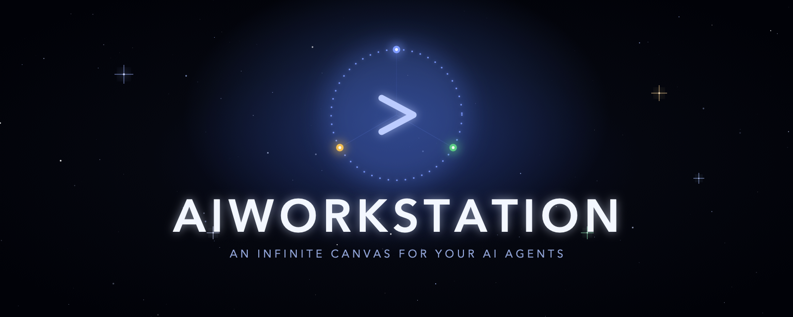
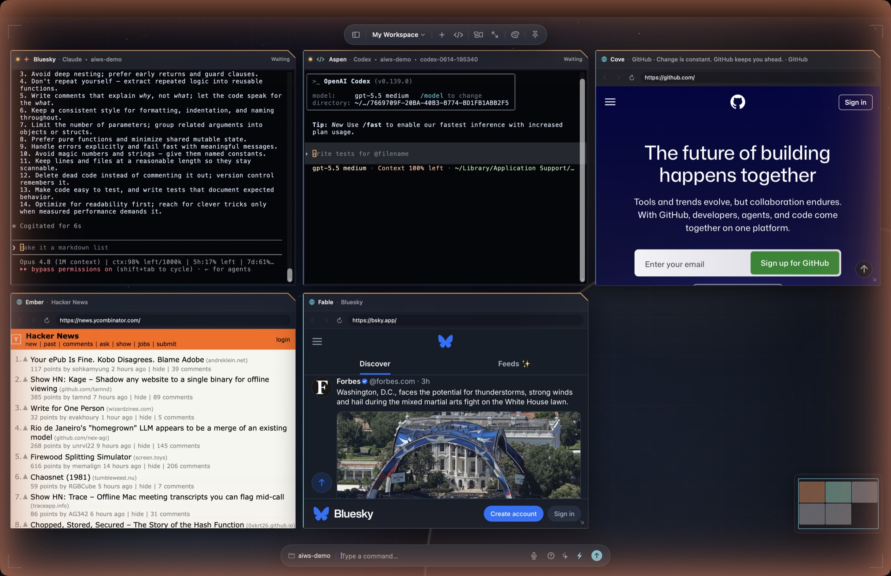
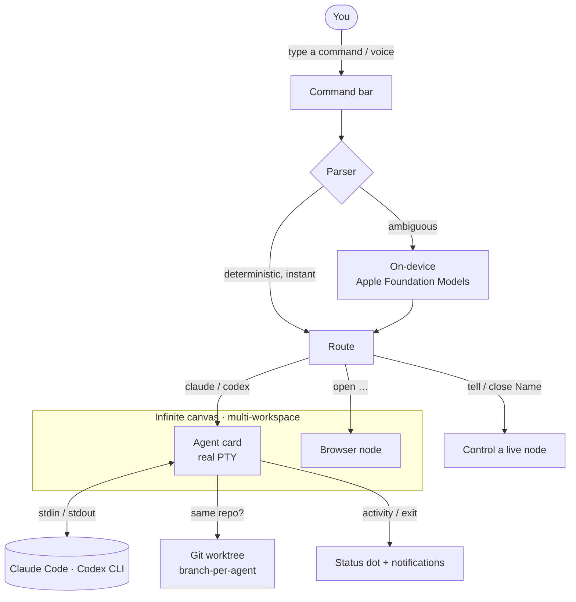

<p align="center">
  
</p>

<p align="center">
  <b>A native macOS canvas for commanding a fleet of AI coding agents — local-first, no backend, no accounts.</b>
</p>

<p align="center">
  <i>Your agents shouldn't live in a dozen terminal tabs.</i><br>
  <i>AIWorkstation gives them a place — a canvas where every agent is a card you can see, arrange, and talk to.</i><br>
  <i>Real terminals, real git isolation, all on your Mac. The cloud is optional; the chaos is not.</i>
</p>

<p align="center">
  
  
  
  
  
</p>

---

## Table of contents

- [Why AIWorkstation?](#why-aiworkstation)
- [What it is](#what-it-is)
- [What it isn't](#what-it-isnt)
- [Features](#features)
- [Screenshots](#screenshots)
- [Requirements](#requirements)
- [Build from source](#build-from-source)
- [Quick start](#quick-start)
- [Command grammar](#command-grammar)
- [Architecture](#architecture)
- [Keyboard shortcuts](#keyboard-shortcuts)
- [Project layout](#project-layout)
- [Privacy](#privacy)
- [Contributing](#contributing)
- [License](#license)
- [Acknowledgments](#acknowledgments)

---

## Why AIWorkstation?

Coding agents are powerful — until you run more than one. Then the workflow falls apart:

- You juggle agents across **separate terminal tabs and windows** with no sense of what's where.
- Two agents in the **same repo** trample each other's working tree.
- You can't tell at a glance **which agent is working, which is waiting on you, and which crashed** — so finished work sits unnoticed.
- Everything lives in **someone else's cloud**.

AIWorkstation turns that into a single spatial surface: every agent is a live card you can see, arrange, and talk to — with real process isolation and a status you can read from across the room.

## What it is

A native Swift/SwiftUI app for macOS that puts **real PTY-backed terminals** on an infinite canvas. Each card runs your installed **Claude Code** or **Codex** CLI as a genuine child process — full TUI, colors, `Ctrl-C`, resize, copy/paste. Agents that share a repo are automatically dropped into isolated **git worktrees** so they never collide. It's local-first: layout and metadata live in a single JSON file, and there is no server.

## What it isn't

- **Not an autopilot.** You drive the agents — it orchestrates terminals, it doesn't make decisions for them.
- **Not a model runner.** It doesn't host or fine-tune models; it drives the agent CLIs you already use.
- **Not a cloud service.** No backend, no accounts, no telemetry.
- **It doesn't bundle the CLIs.** Bring your own `claude` / `codex`; the app auto-detects them.

## Features

| | |
|---|---|
| 🗺️ **Infinite canvas** | Pan, pinch-zoom, and a minimap. Cards are freely placed glass panels; the window is just a viewport. |
| 🖥️ **Real PTY terminals** | Each card is a genuine pseudo-terminal (via [SwiftTerm](https://github.com/migueldeicaza/SwiftTerm)) running your Claude Code / Codex CLI. |
| 🌿 **Git worktree isolation** | A second agent on the same repo automatically gets its own branch + worktree — no clobbering. |
| 🟢 **Live agent status** | A status dot derived from real PTY activity — **Working**, **Waiting**, **Idle**, **Done**, **Error** — with a pulse while busy. |
| 🔔 **Notifications** | In-app toasts + native macOS notifications when an agent finishes, crashes, a worktree is ready, or a CLI is missing. |
| ⌨️ **Command bar** | Type, don't click: `claude fix the bug`, `codex`, `open github in browser`, `tell Harbor run the tests`. Deterministic parsing with an on-device Apple Foundation Models fallback for fuzzy phrasing. |
| 🔎 **Focus Mode** | One agent as a review cockpit: large terminal beside a live diff viewer, repo-state strip (branch · ahead/behind · changed), context files, and a command composer. |
| 🌐 **Browser nodes** | Drop a web view onto the canvas next to your agents — docs, a dashboard, a PR — addressable by name. |
| 🧭 **Multi-canvas workspaces** | Several named canvases in one window (`⌘1`–`⌘9`), each with its own agents, camera, and repo. Move a node between canvases without killing its session. |
| 🎨 **Themes & polish** | Swappable backdrops, System/Light/Dark appearance, push-to-talk voice dictation, a `⌘K` palette, drag-and-drop folders & links. |
| 🔒 **Local-first** | One JSON file under Application Support. No server, no telemetry, no account. |

## Screenshots

<p align="center">
  
</p>

<p align="center"><sub>Two coding agents (Claude Code + Codex, auto-isolated in a git worktree) and three live browser nodes on one canvas — Futuristic theme.</sub></p>

## Requirements

- **To build: Xcode 26 or later.** The app imports Apple's `FoundationModels`, which only exists in the macOS 26 SDK — older Xcode fails with `no such module 'FoundationModels'`.
- **To run: macOS 15+ on an Apple Silicon Mac.** On macOS 26+ with Apple Intelligence the on-device command parser kicks in; on macOS 15 the app runs fine on its deterministic parser.
- The agent CLIs you want to drive, installed and on your `PATH`:
  - [Claude Code](https://docs.anthropic.com/en/docs/claude-code) — `claude`
  - [Codex](https://github.com/openai/codex) — `codex`

  The app auto-detects them through your login shell; you can also point it at a binary in **Settings**.

## Build from source

```bash
git clone https://github.com/sbaruwal/AIWorkstation.git
cd AIWorkstation
open AIWorkstation.xcodeproj      # then ⌘R in Xcode
```

…or from the command line:

```bash
xcodebuild -project AIWorkstation.xcodeproj \
           -scheme AIWorkstation \
           -configuration Debug build
```

Swift Package Manager resolves [SwiftTerm](https://github.com/migueldeicaza/SwiftTerm) automatically on first build — no manual dependency steps.

## Quick start

1. Launch the app. On first run it detects your `claude` / `codex` CLIs.
2. In the command bar at the bottom, type `claude refactor the auth module` and hit return — an agent card spawns in your chosen repo and runs the task.
3. Type `codex` to add a second agent. Same repo? It lands in its own git worktree automatically.
4. Watch the status dots: **green pulse** = working, **amber** = waiting on you.
5. Double-click a card to enter **Focus Mode** and review its diff.

> **Tip:** press the **?** in the command bar for the full grammar, and `⌘K` for the command palette.

## Command grammar

| You type | What happens |
|---|---|
| `claude refactor the auth module` | New Claude agent in the chosen repo, task auto-run |
| `codex` | New Codex agent |
| `open figma in browser` · `open github.com` | New browser node |
| `tell Harbor run the tests` | Follow-up message into the **Harbor** agent |
| `close Harbor` | Close that node |
| `Reef navigate to bsky.app` | Point the **Reef** browser at a site |
| *(just a task)* | Goes to your last-used agent |

> Node names (Harbor, Reef, Aspen…) are auto-assigned and case-insensitive; a 3-letter prefix is enough.

## Architecture



Type a command → it's parsed (instantly when it can be, on-device when it's fuzzy) → routed to spawn an agent, open a browser, or control an existing node by name. Agents run as real child processes; a second agent on the same repo is dropped into an isolated git worktree automatically. The canvas knows about *panels*, the terminal engine knows about *processes*, and an id-keyed registry is the boundary between them.

## Keyboard shortcuts

| Shortcut | Action |
|---|---|
| `⌘K` | Command palette |
| `⌘N` · `⇧⌘N` | New Claude / Codex agent |
| `⌥⌘N` · `⌘1`–`⌘9` | New canvas · switch to canvas N |
| `⌘0` | Fit all to window |
| `⇧⌘T` | Tidy into a grid |
| double-click · `Esc` | Enter / exit Focus Mode |

## Project layout

```
AIWorkstation/
├── App/            App entry, lifecycle, save-on-quit
├── Canvas/         Infinite canvas, camera, state, cards
├── Terminal/       SwiftTerm PTY controllers, live activity
├── Agent/          CLI detection, command parser, on-device smart-parse
├── Browser/        WKWebView browser nodes
├── Git/            Worktree management, diffs, repo state
├── Focus/          Focus Mode cockpit
├── Chrome/         Toolbar, sidebar, command bar, palette, settings, toasts
├── DesignSystem/   Theme tokens, canvas themes, appearance
├── Models/         Codable workspace / panel models
├── Persistence/    Local JSON store
└── Voice/          On-device push-to-talk dictation
```

## Privacy

Everything runs locally. There is no backend and no analytics. The only network traffic is whatever **your** agent CLIs and browser nodes make on your behalf. Session layout and metadata are stored in a single JSON file under `~/Library/Application Support/AIWorkstation/`. Live terminal sessions are never persisted — a restored card offers to relaunch rather than faking a dead process.

## Contributing

Issues and pull requests are welcome. The codebase is plain SwiftUI + AppKit with no exotic dependencies — open it in Xcode and go. Please keep new code within the existing module boundaries and match the surrounding style.

## License

[MIT](LICENSE) © 2026 Sujit Baruwal. Third-party components are listed in [THIRD-PARTY-LICENSES.md](THIRD-PARTY-LICENSES.md).

## Acknowledgments

- [**SwiftTerm**](https://github.com/migueldeicaza/SwiftTerm) by Miguel de Icaza — the terminal engine behind the live PTY cards.
- Built to drive [Claude Code](https://docs.anthropic.com/en/docs/claude-code) and [Codex](https://github.com/openai/codex); this project is not affiliated with or endorsed by their respective owners.
